[HENI YANGUI](mailto:heni.yangui@insat.ucar.tn)[ MOHAMED AZIZ KLAI](mailto:mohamedaziz.klai@insat.ucar.tn)[ FIRAS MILADI](mailto:firas.miladi@insat.ucar.tn)[ SOFIENE AZZABI](mailto:sofiene.azzabi@insat.ucar.tn)

**Part 1 : OpenLDAP, SSH, Apache, OpenVPN**

**Section 1 : Configuration d'OpenLDAP**

1. **OpenLDAP Server Configuration**

installing openldap server:

**sudo apt-get update**

**sudo apt-get install slapd ldap-utils** configure administrator password

configure the ldap server: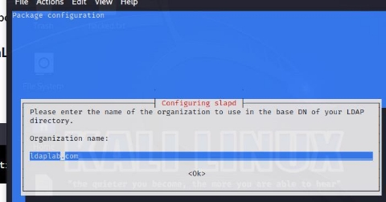

**sudo dpkg-reconfigure slapd**

set organization name, base DN, provide the Administrator password. remove the database when slapd is purged: select ‘NO’.

select ‘Yes’ to remove the old database to create room for a new database.

access ldap.conf file:

**sudo nano /etc/ldap/ldap.conf**

after applying changes:

**sudo service slapd restart sudo service slapd status**

2. **Directory data**

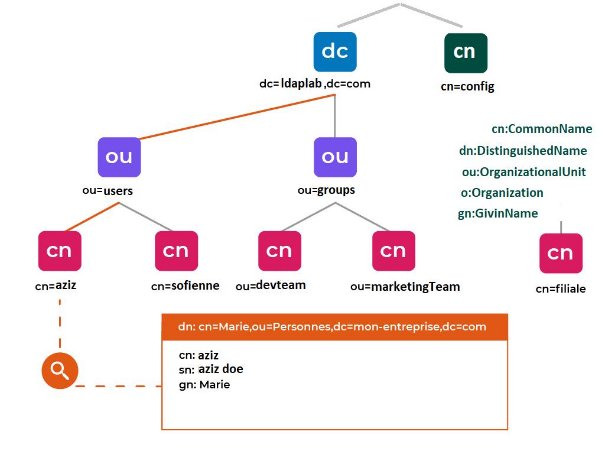

for the ldap directory we added these records: organization unit:{users, groups} groups:{cn=devteam, marketingteam, webusers} users:{uid=aziz, sofien, firas, heni}

create add\_content.ldif: (NB:correct syntax before running command)

……………………………………………………………………………………. dn: ou=users,dc=ldaplab,dc=com

objectClass: organizationalUnit

ou: users

dn: ou=groups,dc=ldaplab,dc=com objectClass: organizationalUnit ou: groups

dn: cn=devteam,ou=groups,dc=ldaplab,dc=com objectClass: posixGroup

cn: devteam

gidNumber: 5000

memberUid:aziz

dn: cn=marketingteam,ou=groups,dc=ldaplab,dc=com objectClass: posixGroup

cn: devteam

gidNumber: 5001

memberUid:sofien

dn: cn=webusers,ou=groups,dc=ldaplab,dc=com objectClass: top

objectClass: groupOfNames

cn: webusers

description: web Users

member: uid=sofien,ou=users,dc=ldaplab,dc=com member: uid=firas,ou=users,dc=ldaplab,dc=com

dn: uid=aziz,ou= users,dc=ldaplab,dc=com objectClass: inetOrgPerson

objectClass: posixAccount

objectClass: shadowAccount

uid: aziz

sn: doe

givenName: aziz

cn: aziz doe

displayName: aziz doe

uidNumber: 10000

gidNumber: 5000

userPassword: {CRYPT}x

gecos: aziz doe

loginShell: /bin/bash

homeDirectory: /home/aziz

dn: uid=sofien,ou= users,dc=ldaplab,dc=com objectClass: inetOrgPerson

objectClass: posixAccount

objectClass: shadowAccount

uid: sofien

sn: da

givenName: sofien

cn: sofien da

displayName: sofien da

uidNumber: 10001

gidNumber: 5001

userPassword: {CRYPT}x

gecos: sofien da

loginShell: /bin/bash

homeDirectory: /home/sofien

dn: uid=firas,ou= users,dc=ldaplab,dc=com

objectClass: inetOrgPerson

objectClass: posixAccount

objectClass: shadowAccount

uid: firas

sn: da

givenName: firas

cn: firas da

displayName: firas da

uidNumber: 10002

gidNumber: 5001

userPassword: {CRYPT}x

gecos: firas da

loginShell: /bin/bash

homeDirectory: /home/firas ………………………………………………………………………

for every user we assigned a given name, homeDirectory, displayName…

let’s add now the content:

**ldapadd -x -D cn=admin,dc=ldaplab,dc=com -W -f add\_content.txt**

make ldap request to check directory content: **ldapsearch -x -LLL -b dc=ldaplab,dc=com dn:**

**change users password:**

**ldappasswd -H ldapi:/// -x -D cn=admin,dc=ldaplab,dc=com -W -S uid=aziz,ou=users,dc=ldaplab,dc=com**

**add x509 Certificate for each user:**

start by generating x509 certificates: (self signed certificates)

the certificate must be published into the LDAP server as a binary piece of data. we encode the certificate in BASE64 and parse it into ldif modifying file: add\_certif.ldif:

dn: uid=aziz,ou=users,dc=ldaplab,dc=com changetype: modify

add: usercertificate

usercertificate;binary:: MIIC2TCCAkKgAwIBAgIBAD…

**ldapmodify -x -D "cn=admin,dc=ldaplab,dc=com" -W -f add\_certif.ldif** check:

3. **Ensure that users can successfully authenticate to the OpenLDAP server **identifying with admin:

**ldapmodify -x -D "cn=admin,dc=ldaplab,dc=com" -W -f add\_user\_to\_devteam.ldif**

with simple user:

**ldapmodify -x -D "uid=firas,dc=ldaplab,dc=com" -W -f add\_user\_to\_devteam.ldif**

**distant ldap client: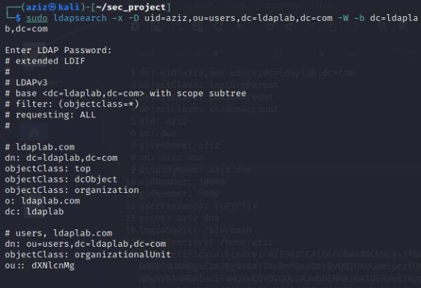**

**apt install libnss-ldapd libpam-ldapd ldap-utils** a nslcd configuration will prompt

we can change that after that manually: ![ref1]![ref2]**nano /etc/nslcd.conf nano /etc/nsswitch.conf**

now we can try login with ldap users make a search form client

4. **LDAPs (ldap secure)**

Pour s'authentifier sur un serveur OpenLDAP, on va **generate certificates:**

autorité de certification (CA):

**openssl genrsa -out CA.key 2048**

**openssl req -x509 -nodes -days 100000 -key insat.key -out cert\_CA**

**NB:**We are placing the CA certificate in the directory /usr/local/share/ca-certificates, where update-ca-certificates will retrieve trusted local CAs. If you want to include CAs from /usr/share/ca-certificates, you need to execute dpkg-reconfigure ca-certificates.

server private key:

**openssl genrsa -out key\_server.pem 2048**

server CSR:

**openssl req -key key\_server.pem -out csr\_server.pem -new**

Sign the CSR with the self-signed certificate's private key

**openssl x509 -req -in csr\_server.pem -out cert\_server.pem -CA cert\_CA.pem -CAkey key\_CA.pem -CAreateserial -days 365**

**mv cert\_server.pem cert\_server.crt**

**place certifs:**

**sudo cp key\_server.pem /etc/ldap/sasl2/**

**sudo cp cert\_server.crt /etc/ldap/sasl2/**

**sudo cp /etc/ssl/certs/ca-certificates.crt /etc/ldap/sasl2/**

**sudo chown -R openldap:openldap /etc/ldap/sasl2/**

certinfo.ldif

**sudo ldapmodify -Y EXTERNAL -H ldapi:/// -f certinfo.ldif nano /etc/default/slapd** add ldaps:///

**nano /etc/default/ldap.conf**

**access via ldaps:** it works 👍

**ldaps advantages: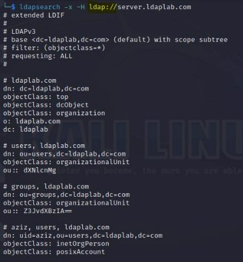**

LDAPS secures LDAP communications through encrypted SSL/TLS connections on port 636. Advantages include data encryption, protection against passive listening, server authentication, strong user authentication, compliance with security standards, LDAP application compatibility, security in untrusted networks, and certificate-based access control. In summary, LDAPS ensures confidentiality, authenticity, and data integrity, though StartTLS is increasingly favored in some cases.

**Section 2 : SSH Authentication**

1. **Activation de l'Authentification SSH via OpenLDAP**

**sudo apt-get install openssh-server libpam-ldap ![ref2]**a nslcd configuration will prompt ![ref1]

**nano /etc/nslcd.conf nano /etc/nsswitch.conf sudo nano /etc/ssh/sshd\_config** add the following

**sudo nano /etc/pam.d/sshd**

2. **Restrict SSH access to a group of users**

assign a group to users and only allow that group to connect via SSH.

**sudo nano /etc/security/access.conf** add GROUP\_ldapgroup

**sudo service ssh restart sudo service nslcd restart**

let’s test:

aziz:devteam not allow to authenticate sofien:marketingteam yes

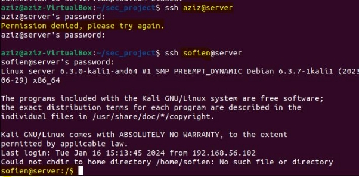

**Section 3 : Integration of Apache**

1. **Enable SSH authentication via OpenLDAP**
1) **sudo apt-get install apache2 libapache2-mod-ldap-userdir**

This command sets up Apache on your system and includes the **mod\_ldap\_userdir** module, enabling user-specific web directories and allowing authentication against an LDAP directory. After installation, you may need to configure Apache and the LDAP module based on your specific requirements.

2) Enable LDAP module in the apache

**sudo a2enmod ldap**

This command enables the Apache module **mod\_ldap**. The **mod\_ldap** module provides support for basic LDAP authentication in Apache. When enabled, it allows Apache to authenticate users against an LDAP directory.

**sudo a2enmod authnz\_ldap**

This command enables the Apache module **mod\_authnz\_ldap**. The **mod\_authnz\_ldap** module extends LDAP support by providing additional features for authentication and authorization. It includes directives that allow you to specify LDAP-related authentication and authorization configurations directly in Apache's configuration files.

3) Add this code to /etc/apache2/sites-available/000-default.conf file

**<Directory /var/www/html>**

**AuthType Basic AuthName "LDAP Authentication"**

**AuthBasicProvider ldap**

**AuthLDAPURL "ldap://<LDAP\_SERVER\_IP>/dc=ldaplab,dc=com?uid"**

**Require valid-user**

**</Directory>**

NB: AuthzLDAPAuthoritative Off: If set to Off, it means that other authorization modules are authoritative, and LDAP decisions are only considered if other modules do not make a definitive decision.

2. **Restrict SSH access to users from the appropriate group in OpenLDAP**

Constrain SSH access exclusively to users belonging to the designated group within OpenLDAP. Subsequently, replace the directive 'required valid-user' with 'Require ldap-group cn=webusers,ou=groups,dc=ldaplab,dc=com' to define the permitted group.

3. **Test for an authorized user and an unauthorized user for SSH** Testing: trying to access apache web page from a distant machine via port 80:

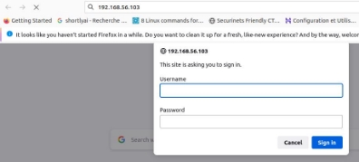

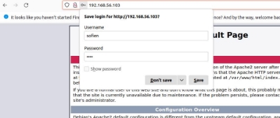

**Section4:Setting up OpenVPN**

1. **Install and configure OpenVPN to use OpenLDAP authentication**
1) **sudo apt install openvpn easy-rsa**

You will have OpenVPN installed on your system, and Easy-RSA will be available to assist in the creation and management of the cryptographic keys and certificates needed for secure communication within the OpenVPN setup.

**2)**Now we generate easy-rsa directory that contains the necessary scripts:

**make-cadir easy-rsa**

**./easyrsa init-pki**

**./easyrsa build-ca >> ca.crt** (save the ca\_key)

**./easyrsa gen-dh** (generate key Diffie-Hellman (DH): dh.pem)

**./easyrsa build-server-full SERVER nopass**

**./easyrsa build-client-full CLIENT nopass**

**openvpn --genkey secret ta.key** (encrypt the tunnel)

for routing: nano **/etc/sysctl.conf** and uncomment: **net.ipv4.ip\_forward=1** then **sysctl -p /etc/sysctl.conf**

**3)**Now we are going to put the generated information in their place under openvpn client and server, we can transfer files to client by scp:

**(server side)cp ta.key pki/dh.pem pki/ca.crt pki/issued/SERVER.crt pki/private/SERVER.key /etc/openvpn**

**(from server to client)scp ta.key pki/ca.crt pki/issued/CLIENT.crt**

**pki/private/CLIENT.key**

**whoami@(hostname -I):/home/aziz**

**(client side)** cp ta.key ca.crt CLIENT.crt CLIENT.key /etc/openvpn

**CONFIG FILES:**

**(server side) nano /etc/openvpn/server.conf:**

- **listen on? (optional)**

**;local a.b.c.d**

- **open up this port on your firewall.**

**port 1194**

- **TCP or UDP server?**

**;proto tcp**

**proto udp**

**;dev tap**

**dev tun**

**ca /etc/openvpn/ca.crt**

**cert /etc/openvpn/SERVER.crt**

**key /etc/openvpn/SERVER.key # This file should be kept secret dh /etc/openvpn/dh.pem**

**server 10.6.0.0 255.255.255.0**

**ifconfig-pool-persist /var/log/openvpn/ipp.txt**

**keepalive 10 120**

**tls-auth /etc/openvpn/ta.key 0 # This file is secret**

**cipher AES-256-CBC**

**persist-key**

**persist-tun**

**status /var/log/openvpn/openvpn-status.log**

**verb 3**

**explicit-exit-notify 1**

**sudo openvpn /etc/openvpn/server.conf** (this command will open the tun1) **sudo systemctl restart openvpn@server**

we can check:

**CONFIG FILES:**

**(client side)**

**nano /etc/openvpn/client.conf:**

**client dev tun proto udp**

- **resplace server.openvpn.com with your server ip remote server.openvpn.com 1194**

  **resolv-retry infinite**

**nobind**

**persist-key**

**persist-tun**

**ca /etc/openvpn/ca.crt**

**cert /etc/openvpn/CLIENT.crt**

**key /etc/openvpn/CLIENT.key**

**remote-cert-tls server**

- **If a tls-auth key is used on the server**
- **then every client must also have the key. tls-auth /etc/openvpn/ta.key 1**

**cipher AES-256-CBC**

**verb 3**

**4)**It is crucial not to overlook the addition of the host address

**5)**launch the OpenVPN client with the specified configuration file

**sudo openvpn /etc/openvpn/client.conf**

**6)**successful connection

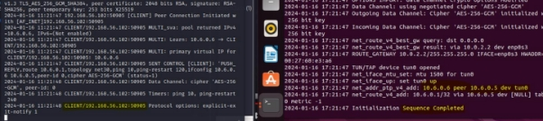

2. **Successfully test the VPN connection using the information from OpenLDAP 1)sudo apt install openvpn-auth-ldap**
2) Once openvpn-auth-ldap package is installed, the required module will be deployed at **/usr/lib/openvpn/openvpn-auth-ldap.so**

   **mkdir /etc/openvpn/auth**

**cp /usr/share/doc/openvpn-auth-ldap/examples/auth-ldap.conf /etc/openvpn/auth/**

**nano /etc/openvpn/auth/auth-ldap.conf:**

**<LDAP>**

- **LDAP server URL**

**URL ldap://server.ldaplab.com**

- **Network timeout (in seconds)**

**Timeout 15**

- **Enable Start TLS**

**TLSEnable no**

- **Follow LDAP Referrals (anonymously)**

**FollowReferrals no**

**</LDAP>**

**<Authentication>**

- **Base DN**

**BaseDN "ou=users,dc=ldaplab,dc=com"**

- **User Search Filter**

**SearchFilter"(&(uid=%u)(accountStatus=active)(memberOf=cn=vpnusers,ou=g roups,dc=ldaplab,dc=com))"**

- **Require Group Membership**

**RequireGroup true**

**</Authentication>**

3) Now we add the server.conf file

**plugin /usr/lib/openvpn/openvpn-auth-ldap.so /etc/openvpn/auth/auth-ldap.conf**

4) Now for the client

we add this to the client.conf:

**auth-user-pass**

5) **systemctl restart openvpn-server@server**

An error may occur in this case it is appropriate to terminate the OpenVPN process and restart it.

result: vpnusers

**6)**Non-authorized user:(it doesn’t work 👎)

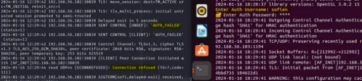

Authorized user:(it works 👍)

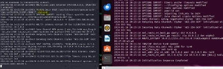

Apache directory : ------------------------------------------------------------------------------------------------------------------------

configure openldap via apache directory

install ldap apache directory on linux: [https://www.youtube.com/watch?v=R0ocFk-pLQ8 ](https://www.youtube.com/watch?v=R0ocFk-pLQ8)<https://directory.apache.org/studio/download/download-linux.html>

new connection>

 

authentication>

to modify the server auth is needed:

adding a new entry with apache directory: ou:users> New >New Entry

create entry from scratch > add objectClass(exp:inetOrgPerson)> add RDN(relative distinguished name)(exp:uid)> add properties

to add password : new attribute> userpassword (uid:heni, password:4444) (uid=firas, password=5555)

end apache directory: -----------------------------------------------------------------------------------------------------------------------------

**Part 2 : Dns**

**Section 1 : Configuring DNS Bind**

We will use a DNS Server for our services. This allows us to use easy-to-remember domain names instead of remembering and updating specific IP addresses when they change.

1. **Configurez un serveur DNS (Bind) sur une machine distincte.**

**sudo apt-get install bind9**

2. **Ajoutez les enregistrements DNS nécessaires pour les serveurs OpenLDAP, Apache, et OpenVPN.**

   **sudo nano /etc/bind/named.conf** add DNS zone:

zone "security.tn" {

type master;

file "/etc/bind/db.security.tn";

};

Create the zone files for each service and add DNS records.

- /etc/bind/db.security.tn

$TTL 604800

@ IN SOA ns1.security.tn. admin.security.tn. (

3 ; Serial

604800 ; Refresh

86400 ; Retry

2419200 ; Expire

604800 ) ; Negative Cache TTL

- Name servers
  - IN NS ns1.security.tn.
- IP addresses for name servers

ns1 IN A 172.20.128.10

- Sample hosts

openldap IN A 172.20.128.2

ssh IN A 172.20.128.4

apache IN A 172.20.128.6

openvpn IN A 172.20.128.8

kdc IN A 172.20.128.12

**sudo service bind9 restart**

**Section 2 : validation and test**

1. **Testez la résolution DNS pour chacun des services configurés.**

For each service machine, **nano /etc/resolv.conf** and add **nameserver <dns\_server\_ip>** . Now every service machine is using our dns server. We restart the services to check whether they are working or not.

2. **Assurez-vous que les noms de domaine associés aux services sont correctement résolus.**

   **nslookup openldap.security.tn**

**nslookup openvpn.security.tn**

**nslookup ssh.security.tn**

**nslookup apache.security.tn**

**Part 3 : kerberos** General idea:

We will use two machines to authenticate a client to an SSH service using a TGT ticket given by a KDC.

Section 1:

1- machine’s set up:

1\.1- Since Kerberos relies on timestamps to issue and verify tickets, we should make sure our machines are synchronized . We can do such a thing using ntp protocol, we will skip this phase since the two machines are correctly synchronized.

1\.2- In each machine match different ips to their sub domain name in /etc/hosts :

To test if everything is working properly try this command on each sub-domain: 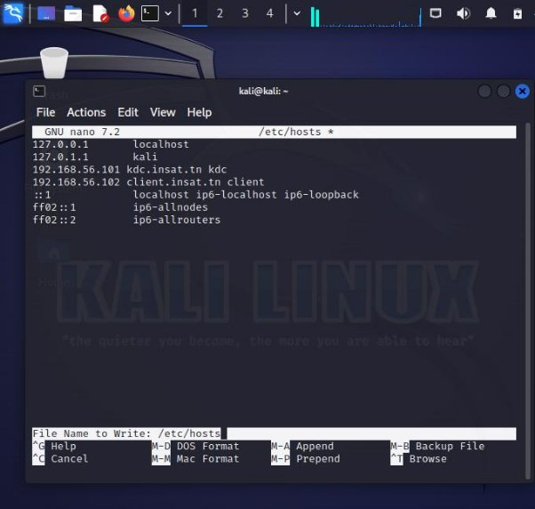host kdc.insat.tn

1\.3- Configure KDC:

apt install krb5-kdc krb5-admin-server krb5-config

1\.4- Setting up Kerberos realm:

This can be done using : krb5\_newrealm

1\.5-then we need to grant the admin privileges by editing /etc/krb5kdc/kadm5.acl:

we just need to uncomment \*/admin\* :

then restart krb5 server:

systemctl restart krb5-admin-server

2- Creating Principals:

2\.1 In order to create Kerberos principals we should first login as admin then: kadmin.local # login as local admin addprinc root/admin # add admin principal

addprinc -randkey host/kdc.insat.tn # add host principal

ktadd host/kdc.insat.tn # generate host principal keytab line

2\.2- To add entry to current key list then write current keylist to the keytab: ktutil

addent -password -p root/admin@INSAT.TN -k 1 -e aes256-cts-hmac-sha1-96 wkt /etc/krb5kdc/kadm5.acl

and the same for the host : ktutil

addent -password -p host/kdc.insat.tn -k 1 -e aes256-cts-hmac-sha1-96 wkt kadm5.acl

2\.3- add a user principal: kadmin.local addprinc user

To force users to change their password upon the first login, you can use the -pwexpire option:

modprinc -pwexpire now user

addpol -maxlife time

Section 2: Authentication with SSH:

1- first we need to install krb5-user

apt install krb5-user

2-install openssh

3- Configure SSH for GSSAPI Authentication:

4-restart ssh service

systemctl restart sshd /ssh

5-the same thing for the kdc machine

6-create a new user in the client machine with the same name of the principale created in kdc :

adduser user

su -l user

7- run in order to send request to get TGT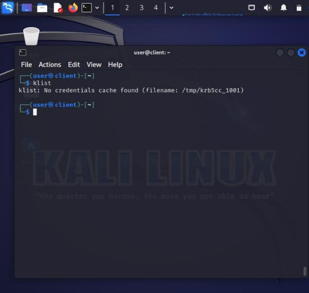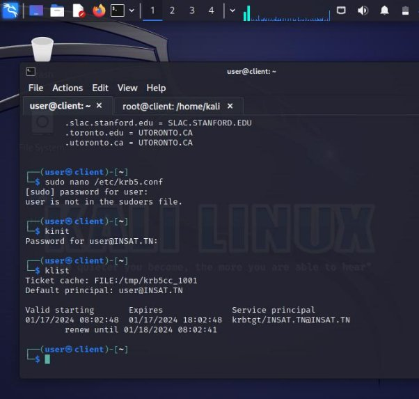

8-then run

The actual SSH connection (ssh kdc.insat.tn) involves the TGS-REQ and TGS-REP steps, where the client requests a service ticket for the SSH service.

then the ssh connection should be setted successfully without a password.

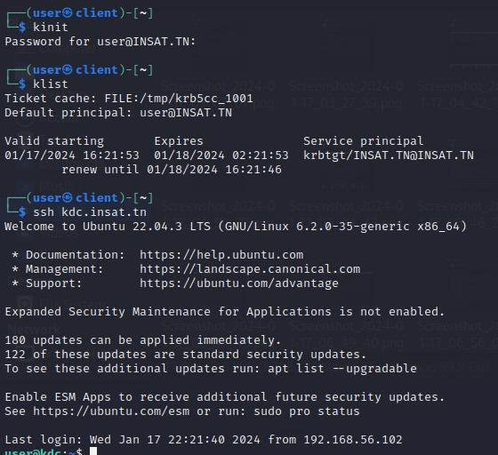

[ref1]: Aspose.Words.7c805726-6d09-47c0-8681-d5cd0721cb39.016.png
[ref2]: Aspose.Words.7c805726-6d09-47c0-8681-d5cd0721cb39.018.png
